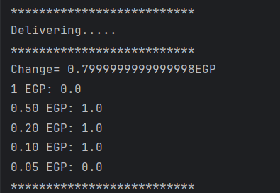

# Vending Machine Simulation

This Java program simulates a vending machine, allowing users to select items, deposit money, receive change, and view sales statistics. The program is implemented using structured programming paradigms without utilizing object-oriented concepts.

## Program Overview

The program is structured around the main method, which orchestrates the vending machine operations. Functionality is modularized into separate functions to enhance clarity and maintainability. User interaction is facilitated through console input and output.

## Functionality

- **Vending Machine Operations**: Users can activate the vending machine, select items from the menu, deposit money, and receive products and change.
- **Admin Mode**: Authorized personnel can access statistics by entering a PIN code. This mode displays total income and the percentage of sold products.

## Screenshots

### Menu and Prices + Customer Selection + Customer Total

*Description: This image shows the vending machine menu with prices, a customer making a selection, and the total amount.*

### Change Returned After Misusing Deposit

*Description: This image demonstrates the change returned after misusing the deposit from the total.*

### Admin and Machine Sales Statistics

*Description: This image displays the admin mode and machine sales statistics.*

## Usage

1. Run the program.
2. Input "start" to activate the vending machine.
3. Follow the prompts to make selections and complete transactions as a customer.
4. Access admin mode by inputting "99" and entering the correct PIN code (default: 12345) to view statistics.

## Contribution

Contributions to improve the program's functionality or efficiency are welcome. Fork the repository, make changes, and submit a pull request.

## License

This program is licensed under the [MIT License](LICENSE).
